# Forest Type Mapping

## Team members

***August Rodermans - 1701212999***

***Jason Tian- 1701213094***

***Daniel Bonfil - 1801214680***

## Introduction
We use machine learning algorithms to categorize tree species, based on their color index on satellite images taken in September, March and May. This project uses a dataset made available by **UC Irvine Machine Learning Repository**. We think the project is interesting and meaningful, because the output (forest type map) can be used to identify and/or quantify ecosystem services (e.g.: carbon storage, erosion protection) provided by the forest, which has significant effect on environment protection.

## Data Source
We derived our dataset from UC Irvine Machine Learning Repository.
Source: http://archive.ics.uci.edu/ml/datasets/Forest+type+mapping

## Data Summary Statistics
This dataset contains 523 samples and 27 features from a remote sensing study which mapped different forest types based on their spectral characteristics at visible-to-near infrared wavelengths, using ASTER satellite imagery of an area in Japan.
Here is an example of our dataset:

**The attributes contain information on the following:**

* S：Sugi forest
* H: Hinoki forest
* D: Mixed deciduous forest
* O: Other non forest land

* b1 - b9: ASTER image bands containing spectral information in the green, red, and near infrared wavelengths for three dates (Sept. 26, 2010; March 19, 2011; May 08, 2011.)
* pred_minus_obs_S_b1 - pred_minus_obs_S_b9: Predicted spectral values (based on spatial interpolation) minus actual spectral values for the 's' class (b1-b9)
* pred_minus_obs_H_b1 - pred_minus_obs_H_b9: Predicted spectral values (based on spatial interpolation) minus actual spectral values for the 'h' class (b1-b9)		

**A graphical representation:**
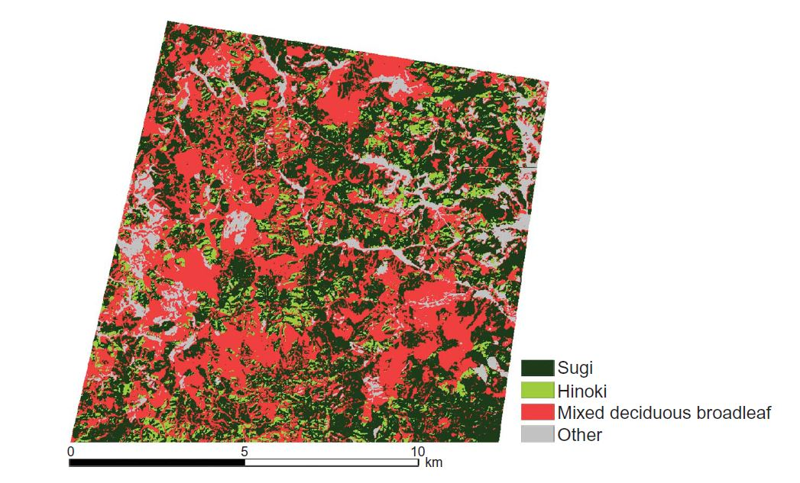

Refference:
Johnson, B., Tateishi, R., and Xie, Z., 2012, Using geographically weighted variables for image classification, remote sensing letters,Vol.3 No. 6

## Our project approach:
* Visualize the data with Seaborn
* Feature selection / dimension reduction
* LR, Perceptron, SVM Linear / RBF, KNN, Decision Tree, Random Forest  
* Neural network*
* Performance comparison

**Please open our forrest.IPYNB file and find out how we did everything!**

## Exploratory Data Analysis (EDA)
We used Seaborn to understand the distribution of the data and the relationship between features.
Since we are using more than 2 classes, we encoded the different tree types s, h, d, & o with 1, 2, 3, & 4.
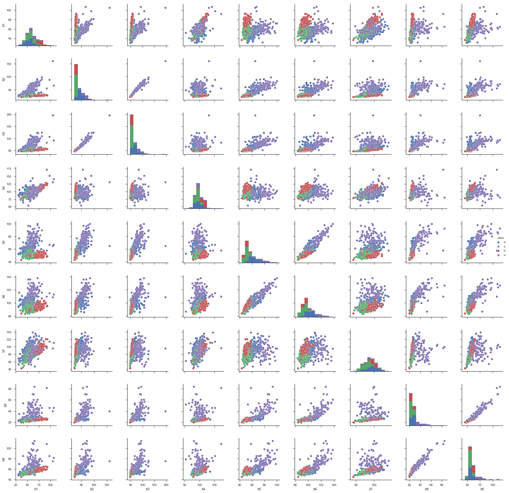

## Principal Component Analysis (PCA)
* We split the data and implemented PCA from sklearn plot the test dataset to see if it can separate the classes well. (Inner Works on Code)
* The resulting plot indicates that the first principal component alone accounts for about 40% of variance.

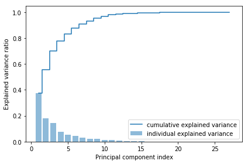

* After executing PCA, we can see in the resulting plot, the data is more spread along the x-axis,the first principal component,than the PC2, which is consistent with the explained variance ratio plot that we created above.

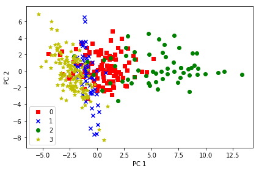

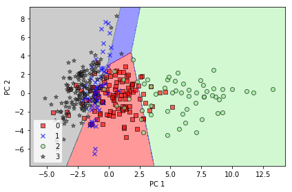

## LDA
* We plot the linear discriminants Using LDA from sklearn. (Inner Works on Code)

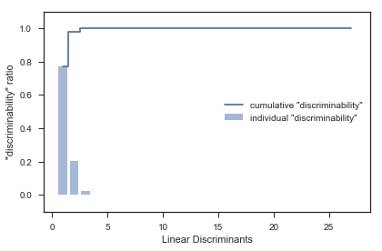

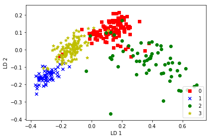

* As we can see from the figure, the first three linear discriminants alone capture 100% of useful information in the dataset.
* Using the transformation matrix, we transform the training dataset. 
**Now the four forests classes are perfectly linearly separable.

## Implementing 6 Different Methods:

* 1 LogisticRegression Model

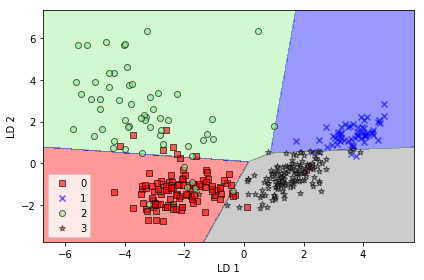

**Missclasified Samples: 51 | Accuracy: 0.675159**

* 2 Perceptron (40 iterations, 02 eta

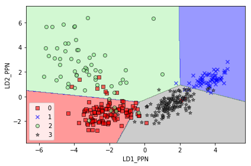

**Misclassified samples: 50 | Accuracy: 0.681529**

*We introduce different interations in each model to show a more comprehensive undestanding of the model and its sensitivity to different arguments:
1. Perceptron with 1, 10 and 28, 30 and 80 iterations.
Perceptron with 28 iterations and eta of 0.001, 0.5 and 0.9.  

* 3 SVM_linear

  
**Misclassified samples: 32 | Accuracy: 0.796178**

*We introduce different interations in each model to show a more comprehensive undestanding of the model and its sensitivity to different arguments:
1. SVM with C of 0.001, 0.1 and 0.8.
  
* SVM_RBF

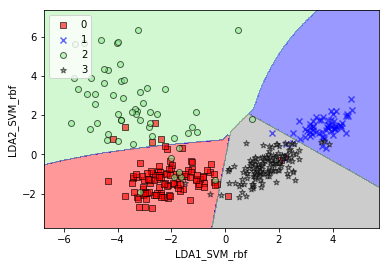

**Misclassified samples: 29 | Accuracy: 0.815287**

*We introduce different interations in each model to show a more comprehensive undestanding of the model and its sensitivity to different arguments:
1. SVMrf with Gamma values of 0.001, 0.1, 0.5 and 0.9 each one tested with C values of 1 and 10, respectively.

* 4 KNN

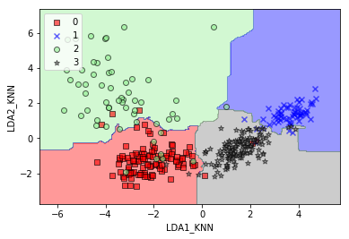

**Misclassified samples: 28 | Accuracy: 0.821656**

*We introduce different interations in each model to show a more comprehensive undestanding of the model and its sensitivity to different arguments:
1. KNN with 1, 3 and 8 nearest neighbors.

* 5 Decision Tree

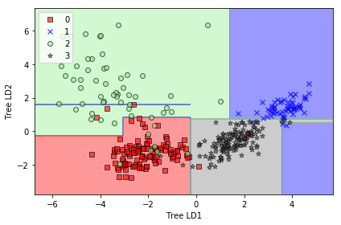

**Misclassified samples: 34 | Accuracy: 0.783439**

*We introduce different interations in each model to show a more comprehensive undestanding of the model and its sensitivity to different arguments:
1. DT with 1, 3 and 7 estimators.

* 6 Random Forrest

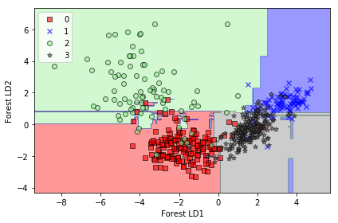

**Misclassified samples: 33 | Accuracy: 0.789809**

* 7 Neural Network
The last thing we did is to train a Neural Network on the data.
The accuracy on the training set was 91% but we didn't do cross validation yet.
How ever, it is likely that cross validation would render us lower accuracy scores because it would reduce our training sample drastically while sample size is very important is not great for Neural Networks.

*We introduce different interations in each model to show a more comprehensive undestanding of the model and its sensitivity to different arguments:
1. RF with 1, 30 and 70 max depth.

### Our best accuracy was achieved KNN (Accuracy= 0.821656, K=5)
### We compare our accurracy rate with the one presented in the paper cited, we can appreciate that KNN yields a higher accuracy rate than SVM used in the research. However, it must be noted that the paper introduces a special IDE interpolation technique used by experts in ecology and forestry; when compared to this techinque the accurracy is lower. For further research it would be interesting to include IDE interpolation technique to KNN and other different methods to compare accurracy among. 

## Reference
Original Paper: Johnson, B., Tateishi, R., and Xie, Z., 2012, Using geographically weighted variables for image classification, remote sensing letters,Vol.3 No. 6
